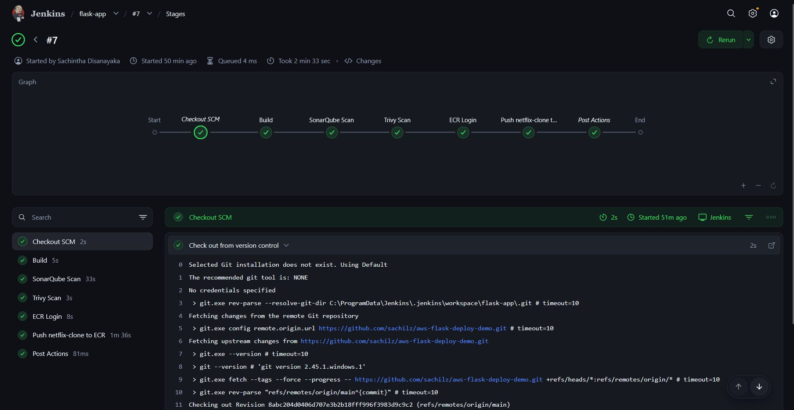
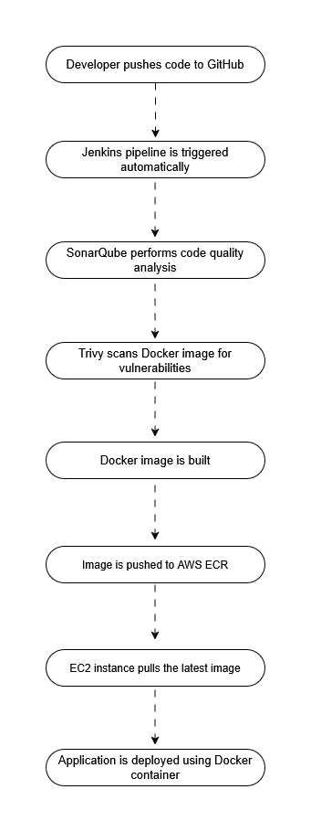
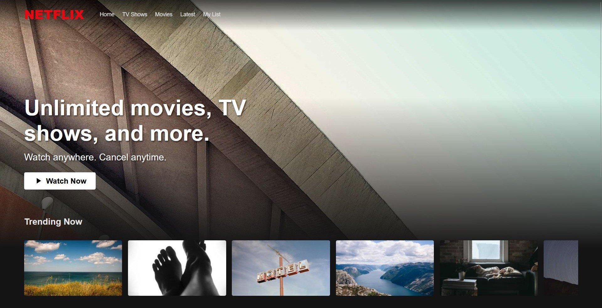

## Cloud-Native DevSecOps Pipeline: Secure Flask Web Application on AWS 🚀

### Overview 📌
This project demonstrates a cloud-native DevSecOps pipeline for deploying a secure Flask-based web application using Docker and AWS <br>
The goal of this project is to implement a fully automated CI/CD pipeline with integrated security checks, ensuring that applications are built, scanned, and deployed securely in a production-like environment

### Architecture 🏗️


### CI/CD Pipeline Diagram 🔁


### Tech Stack 🛠️
- Application : Flask (Web Framework)
- Containerization : Docker
- CI/CD : Jenkins
- Security Tools : SonarQube (Code Quality Analysis) | Trivy (Container Vulnerability Scanning)
- Cloud Services (AWS) : ECR (Elastic Container Registry) | EC2 (Compute Instance) | IAM (Access Control & Security)

### CI/CD Pipeline Flow ⚙️


### Security Implementation 🔐
- Integrated SonarQube for static code analysis
- Used Trivy to detect vulnerabilities in Docker images
- Applied IAM roles to enforce secure access control
- Followed DevSecOps “Shift-Left” principle

### Application Screenshot 📸


## Setup Instructions 🚀
### Prerequisites
- Docker installed
- AWS account
- Jenkins configured
- SonarQube server setup

## Steps
### Clone the repository
```bash
git clone https://github.com/sachilz/Secure-Flask-Web-Application-on-AWS.git
```
### Navigate to project
```bash
cd Secure-Flask-Web-Application-on-AWS
```
### Build Docker image & Container
```bash
docker compose up --build -d
```

## Key Features 🌟
- Fully automated CI/CD pipeline
- Integrated security scanning (DevSecOps)
- Cloud deployment using AWS
- Containerized application for consistency
- Production-style workflow implementation

## What I Learned 📚
- Building end-to-end CI/CD pipelines using Jenkins
- Integrating security tools into DevOps workflows
- Containerizing applications using Docker
- Deploying applications securely on AWS (ECR, EC2, IAM)
- Understanding real-world DevSecOps practices

## Folder Structure 📂
```text
Secure-Flask-Web-Application-on-AWS/
├── asset/
├── docs/
├── static/
│   └── style.css
├── templates/
│   └── index.html
├── .dockerignore
├── .gitattributes
├── app.py
├── docker-compose.yml
├── Dockerfile
├── Jenkinsfile
└── README.md
```
## Author 👤
Sachintha Dilshan <br>
LinkedIn: https://www.linkedin.com/in/sachilz/
